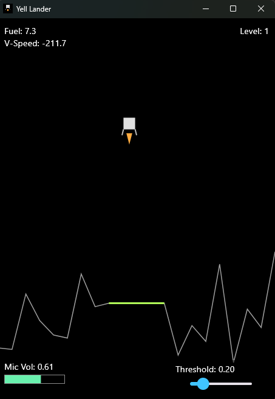

# Yell Lander - Voice Controlled Lunar Landing 🚀

[](https://flutter.dev)
[](https://flame-engine.org)
[](https://opensource.org/licenses/MIT)

A classic Lunar Lander game built with Flutter and the Flame engine, where you control the lander's thrust using your **microphone volume**! Navigate treacherous terrain, manage your fuel, and aim for a soft landing on the designated pads across multiple challenging levels.

"SAY AAA-A-A AND FLY!"

This game is part of the [20 Games Challenge](https://20_games_challenge.gitlab.io/games/lander/).



## 🚀 Features

*   **Voice-Controlled Thrust:** The louder you are, the more thrust your lander generates!
*   **Classic Lander Gameplay:** Manage fuel, control vertical speed, and avoid crashing.
*   **Multiple Levels:** Progress through `GameConfig.maxLevels` (currently 3) levels with increasing gravity.
*   **Procedurally Generated Terrain:** Each level presents a new landing challenge.
*   **Interactive HUD:**
    *   Real-time display of Fuel, Vertical Speed, and Current Level.
    *   Microphone Volume indicator bar.
    *   Adjustable **Thrust Threshold Slider**: Fine-tune how sensitive the engine is to your voice.
*   **Responsive Design:** Adapts to different screen sizes.
*   **Cross-Platform:** Built with Flutter, aiming for mobile and web compatibility (microphone access required).

## 🎮 How to Play

1.  **Objective:** Safely land the lunar module on the **bright green landing pad**.
2.  **Controls:**
    *   **Thrust (Microphone):** Make noise into your microphone (e.g., say "Aaaaaah!") to activate the lander's thrusters. The louder your voice, the stronger the thrust.
    *   **Start/Advance/Retry (Tap or Spacebar):**
        *   Tap the screen or press the `SPACEBAR` to start the game from the welcome screen.
        *   Use the same input to advance to the next level after a successful landing.
        *   Use it to restart the game if you crash or if microphone permissions were initially denied.
    *   **Thrust Threshold Slider (On-Screen):** Adjust this slider (bottom-right) to set the minimum microphone volume required to activate the thrusters.
        *   Slide to the **left** (lower value) for more sensitive thrust (easier to activate).
        *   Slide to the **right** (higher value) for less sensitive thrust (requires louder input).
3.  **Landing Safely:**
    *   You must land on the designated green pad.
    *   Your vertical speed (`V-Speed`) must be below `GameConfig.safeLandingSpeed` (currently 100.0) at the moment of touchdown.
4.  **Game Over:**
    *   Crashing into the terrain.
    *   Landing too hard (exceeding safe landing speed).
    *   Landing off the designated pad.
    *   Running out of fuel before landing (you'll just fall!).
5.  **Winning:** Successfully complete all `GameConfig.maxLevels`.

## 🛠️ Setup and Running

1.  **Prerequisites:**
    *   Flutter SDK installed.
    *   A configured IDE (like VS Code) or command line.
    *   A microphone connected and enabled on your device/computer.

2.  **Clone the Repository:**
    ```bash
    git clone https://github.com/konyshevgmbh/yell_lander.git
    cd yell_lander
    ```

3.  **Get Dependencies:**
    ```bash
    flutter pub get
    ```

4.  **Run the Game:**
    *   **Mobile (Android/iOS):**
        ```bash
        flutter run
        ```
        Ensure you grant microphone permissions when prompted by the app.
    *   **Web:**
        ```bash
        flutter run -d chrome --web-renderer html
        ```
        Your browser will likely ask for microphone permission for the site. The `html` renderer is often better for microphone access consistency on the web with `flutter_recorder`.
    *   **Desktop (Windows/macOS/Linux):**
        ```bash
        flutter run -d windows  # or -d macos / -d linux
        ```
        Ensure microphone permissions are granted at the OS level.
5.  **Updating App Icons:**
        
    ```bash
    dart run flutter_launcher_icons
    ```

## ⚙️ Configuration

Most game parameters are defined in `lib/main.dart` within the `GameConfig` class. You can tweak these values to change the gameplay:

*   `maxLevels`: Total number of levels.
*   `initialFuel`: Starting fuel for the lander.
*   `baseGravity`: Initial gravity, increases with `gravityLevelMultiplier`.
*   `safeLandingSpeed`: Maximum vertical speed for a safe landing.
*   `defaultMinEngineVolumeThreshold`: Initial sensitivity for voice-controlled thrust.
*   `landerThrustPower`: Force applied by the lander's engine.
*   `landerFuelConsumptionRate`: How quickly fuel is used.
*   And many more related to terrain generation, HUD appearance, etc.

## 📁 Project Structure

*   `main.dart`: Contains the main game logic (`LunaLanderGame`), HUD overlay (`HudOverlay`), game state management, configuration constants (`GameConfig`), and game messages (`GameMessages`).
*   `LunarLander` class: Represents the player-controlled lander component, handling its physics, rendering, and fuel.
*   `LunarSurface` class: Represents the game's terrain, responsible for generating and rendering the surface and landing pad.

## 📦 Key Dependencies

*   [flame](https://pub.dev/packages/flame): The 2D game engine used.
*   [flutter_recorder](https://pub.dev/packages/flutter_recorder): For accessing microphone input and volume levels.
*   [permission_handler](https://pub.dev/packages/permission_handler): To request microphone permissions on mobile platforms.

## 💡 Potential Future Enhancements

*   Horizontal movement controls.
*   More varied terrain types or obstacles.
*   Sound effects for thrust, landing, crashing.
*   Persistent high scores or level times.
*   Different lander models with varying stats.
*   Visual polish (e.g., particle effects for dust, better explosion).

## 📜 License

This project is licensed under the MIT License - see the [LICENSE.md](LICENSE.md) file for details (if you add one).

---

Happy Landing! 🌕🎤
